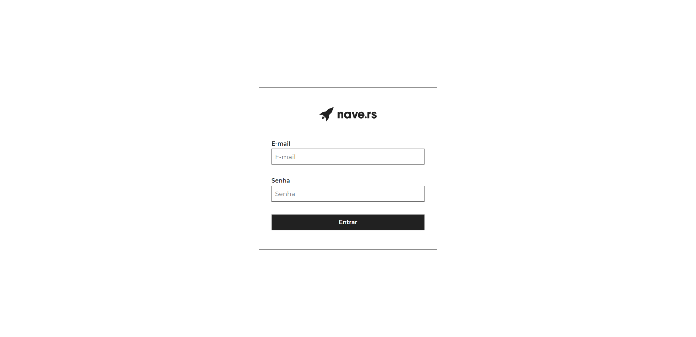
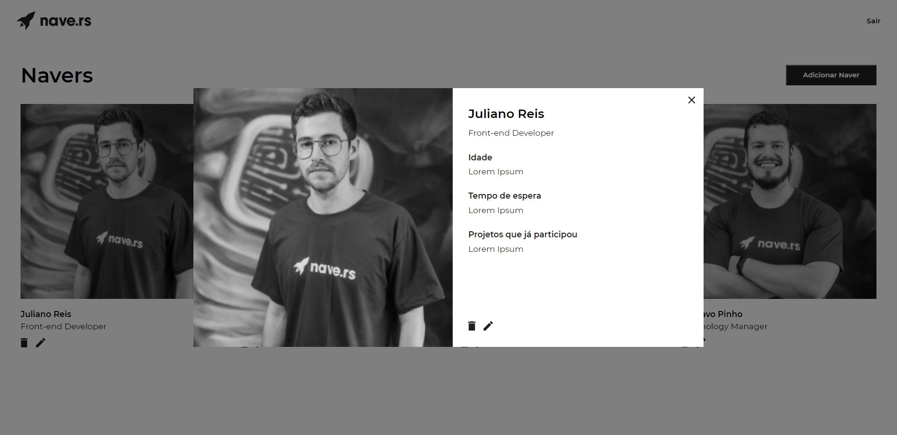
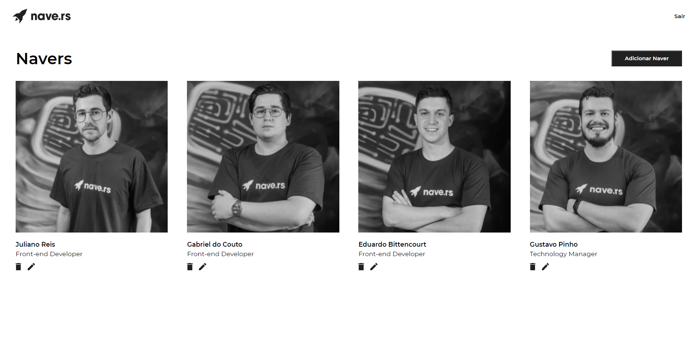

<h1 align="center">Navedex</h1>

## 📔 Sobre
  Navedex é uma plataforma de Navers. 
  
---

## 🖥 Telas
<h1 align="center">
  
  
  
</h1>

---

## 🛠 Tecnologias 

- React
- Styled Components
- HTML
- CSS
- Javascript

---

## ⌨ Como clonar e rodar o projeto
```bash
# Clone este repositório
git clone https://github.com/derickcjesus/navedex

# Entre na pasta
cd navedex

# Abra seu vscode pelo terminal
code .

# Rode o servidor local
yarn start

```

---

## Dificuldades
  Com o conhecimento que tenho sobre desenvolvimento frontend, consegui apenas criar as telas da aplicação. Pude treinar sobre flexbox e grid e me senti satisfeito com o resultado. Pretendo não parar por aqui e continuar estudando sobre o universo do desenvolvimento web. Agradeço a [Nave.rs](https://nave.rs/) pela oportunidade. :rocket:
---
